# SecureAI-KYC Architecture

## Pipeline Overview

This document outlines the end-to-end processing pipeline for the SecureAI-KYC fraud detection and document verification system.

```mermaid
flowchart TD
    subgraph Upload["Document Upload Layer"]
        U1[Aadhaar / PAN / Passport / Salary Slip / Utility Bill]
    end

    subgraph Integrity["Integrity Validation Layer"]
        I1[Format check]
        I2[Blur / corruption check]
        I3[Metadata presence]
        I4[Resolution validation]
    end

    subgraph TypeDetection["Document Type Detection"]
        T1[OCR keyword recognition]
        T2[Template classification]
        T3[Layout detection]
    end

    subgraph Forgery["Forgery Detection Layer"]
        F1[1. OCR + Font Anomaly Detection]
        F2[2. Pixel / Tampering Detection]
        F3[3. Template & Layout Validation]
        F4[4. EXIF / Metadata Forensics]
        F5[5. Photo / Face Region Validation]
        F6[6. QR Validation]
    end

    subgraph CrossVal["Cross-Validation Layer"]
        C1[OCR fields ↔ template fields]
        C2[OCR text ↔ QR data]
        C3[Photo region ↔ document layout]
        C4[Metadata ↔ upload timestamp]
        C5[Extracted fields ↔ expected schema]
    end

    subgraph Scoring["Fraud Scoring Engine"]
        S1[Weighted confidence scoring]
        S2[Risk score: 0 – 100]
    end

    subgraph Output["Explainable Output Layer"]
        O1[Genuine / Suspicious / Fake]
        O2[Heatmap + reasons + score]
    end

    Upload --> Integrity
    Integrity --> TypeDetection
    TypeDetection --> Forgery
    Forgery --> CrossVal
    CrossVal --> Scoring
    Scoring --> Output
```

## Layer-by-Layer Breakdown

### 1. Document Upload Layer
Accepts multiple document types including standard government IDs (Aadhaar, PAN, Passport) and supporting verification documents (Salary Slips, Utility Bills).

### 2. Integrity Validation Layer
Acts as a computational shield. Immediately rejects corrupted, highly blurred, or low-resolution images before wasting compute power on expensive ML processing:
- Formats (MIME validation)
- Blur Detection (Laplacian variance)
- Resolution Thresholding

### 3. Document Type Detection
Routes the document to the correct downstream template configuration:
- OCR Keywords ("Income Tax Department", "Government of India")
- Aspect Ratio and Template shape matching
- Spatial layout analysis

### 4. Forgery Detection Layer
The core multi-agent forensic engine running parallel checks:
- **Semantic & Font:** Validating extracted text and checking for font splicing.
- **Error Level Analysis (ELA):** Detecting pixel-level tampering and compression artifacts.
- **Template & Layout:** Verifying physical dimensions and field placements.
- **EXIF Forensics:** Uncovering photoshop traces or metadata anomalies.
- **Face & Photo:** Deepfake detection, face counting, and alignment checks.
- **QR Decoding:** Parsing embedded digital signatures (e.g., UIDAI secure QR).

### 5. Cross-Validation Layer (The Moat)
Correlating outputs from parallel agents to detect deep inconsistencies:
- Verifying the printed OCR `Name` and `DOB` against the embedded QR data.
- Checking structural alignment of the photo bounding box against expected template boundaries.
- Temporal validation of EXIF timestamps against the upload time.

### 6. Fraud Scoring Engine
Aggregates the multi-agent signals into a single standardized metric.
- Dynamic weighting (e.g., QR match carries more weight than EXIF).
- Handles boosting based on specific red flags (e.g., mismatched DOB).
- Produces a final `0-100` risk score.

### 7. Explainable Output Layer
Translates the numerical score and agent flags into a human-readable, auditable decision.
- **0–30:** Genuine
- **31–65:** Suspicious (Manual Review)
- **66–100:** Forged (Auto-Reject)
- Returns a rich payload containing visual heatmaps and exact reasoning for compliance purposes.
